# How the claudia.gallery homepage is built

A study guide to this copy of the [claudia.gallery](https://claudia.gallery/) homepage. It covers the colour and type
system, the layout grid, and the code behind the two moving parts of the hero: the split-flap board and the face boxes.

Claudia by anabology. The site's design and code belong to its author; this repository copies them for study (see the
[README](README.md)). Every number in this guide was measured on the page or computed from its CSS, and the figures in
[`docs/study/`](docs/study/) were drawn from the real layout.

Links such as [`site.css` L63–L72](static/css/site.css#L63-L72) open the file on GitHub with those lines highlighted.
The stylesheet puts each rule on a single line. In this guide the CSS is spread over several lines so it's easier to
read, but the line numbers always refer to the real file.

## Before you start: trying things from an iPad

Most sections end with **Try it** experiments. There are two ways to try them.

**Tap them in the [playgrounds](https://plexormedia.github.io/claudia-gallery-study2/play/).** These three pages are
built from the homepage's own stylesheet and code, so you can experiment without editing a file, and nothing you do
there changes the site:

- The [CSS lab](https://plexormedia.github.io/claudia-gallery-study2/play/lab.html) shows the homepage in a frame, at
  phone, iPad or laptop width, and applies any CSS you type at once. Every CSS **Try it** in this guide is there, one
  tap away.
- The [split-flap playground](https://plexormedia.github.io/claudia-gallery-study2/play/flaps.html) puts the board's
  timing and tile size on sliders and charts every run (section 5).
- The [face-box playground](https://plexormedia.github.io/claudia-gallery-study2/play/facebox.html) crops a hero photo
  to any screen and works out the face box step by step, as place() does (section 6).

**Add them to the copy** when you want to keep a change. The easiest place for CSS is
[`static/css/study-copy.css`](static/css/study-copy.css). The page loads it after `site.css`, so a rule you add there
wins over the original without changing it.

From an iPad you can make a change in two ways:

1. Ask Claude in a session: "add this rule to study-copy.css and push".
2. On github.com, open `static/css/study-copy.css`, tap the pencil icon, add the rule at the end, and commit to `main`.

GitHub Pages republishes the [live copy](https://plexormedia.github.io/claudia-gallery-study2/) about a minute after
each commit. Your browser may keep the old stylesheet for a few minutes; a private tab always loads fresh files. To
undo an experiment, delete its lines. JavaScript experiments have to go in `static/js/site.js` itself. The first commit
(`2c50741`) keeps the original files if you want to compare.

## Contents

1. [The big picture](#1-the-big-picture)
2. [Colour](#2-colour)
3. [Type](#3-type)
4. [Layout](#4-layout)
5. [The split-flap board](#5-the-split-flap-board)
6. [The face boxes](#6-the-face-boxes)
7. [Smaller patterns worth borrowing](#7-smaller-patterns-worth-borrowing)
8. [Glossary](#8-glossary)

---

## 1. The big picture

### 1.1 Three files, no build step

The homepage is plain HTML, CSS and JavaScript, written by hand. There is no framework, no bundler and no CSS
preprocessor, so the files you read are exactly what the browser runs.

| File | Lines | What it holds |
|---|---|---|
| [`index.html`](index.html) | 251 | The content, in reading order |
| [`static/css/site.css`](static/css/site.css) | 567 | Every style: the tokens first, then one block per component |
| [`static/js/site.js`](static/js/site.js) | 282 | Every behaviour, in one function with no dependencies |
| [`static/fonts/`](static/fonts/) | 7 fonts | The web fonts and their licences (section 3) |

`site.css` and `site.js` serve the whole original site, so they also hold code for pages that aren't copied here (the
film rooms, the gallery, the lightbox, the wiki). The homepage uses these parts:

- **CSS:** [L1–L228](static/css/site.css#L1-L228) (tokens, base styles, components), the film player
  [L330–L334](static/css/site.css#L330-L334), and the reduced-motion and phone rules
  [L509–L531](static/css/site.css#L509-L531).
- **JavaScript:** [L1–L83](static/js/site.js#L1-L83) (header, split-flaps, hero, video loops, copy buttons) and the
  film player [L242–L257](static/js/site.js#L242-L257).

### 1.2 The page, top to bottom

| Part | HTML | CSS | JavaScript |
|---|---|---|---|
| Header | [L29–L35](index.html#L29-L35) | [L43–L60](static/css/site.css#L43-L60) | [L9–L16](static/js/site.js#L9-L16) |
| Hero: photos, face boxes, split-flap | [L37–L64](index.html#L37-L64) | [L62–L103](static/css/site.css#L62-L103) | [L18–L64](static/js/site.js#L18-L64) |
| 01 Who she is | [L66–L81](index.html#L66-L81) | [L105–L144](static/css/site.css#L105-L144) | copy buttons [L73–L83](static/js/site.js#L73-L83) |
| 02 Three films | [L83–L127](index.html#L83-L127) | [L146–L181](static/css/site.css#L146-L181) | video loops [L66–L71](static/js/site.js#L66-L71), player [L242–L257](static/js/site.js#L242-L257) |
| 03 Her looks | [L129–L193](index.html#L129-L193) | [L184–L192](static/css/site.css#L184-L192) | none |
| 04 The wiki | [L195–L206](index.html#L195-L206) | [L194–L202](static/css/site.css#L194-L202) | none |
| 05 For agents | [L208–L230](index.html#L208-L230) | [L204–L218](static/css/site.css#L204-L218) | copy buttons |
| Footer | [L232–L245](index.html#L232-L245) | [L220–L228](static/css/site.css#L220-L228) | none |

### 1.3 The idea: a plain base and three film skins

The first line of the stylesheet is a comment that sums up the design: "one black canvas, one clay accent, three film
skins (ev · cly · bliss)".

The base is deliberately plain: near-black surfaces, off-white text and a single orange. Everything with personality
is borrowed from one of the three films:

- **The split-flap board** comes from ESCAPE VELOCITY, where a board counts down "18 MONTHS TO ESCAPE THE PERMANENT
  UNDERCLASS".
- **The face boxes** on the hero photos are detector output. The script calls them "real Grounding DINO boxes from the
  films' plates" (section 6).
- **The small uppercase monospace labels** read like instrument readouts. The stylesheet's heading for them is
  "label system (EV's readouts)".
- **The Windows XP window** around the BLISS video comes from BLISS, a film shot as an XP screen recording. The footer
  line "It's now safe to turn off your computer." is the old Windows shutdown message.
- **The condensed black capitals** of the section titles are the same type as the CLODYSSEY title.

So the design has two layers: a neutral base shared by every section (sections 2 to 4 of this guide), and touches from
one film used where that film appears.

---

## 2. Colour

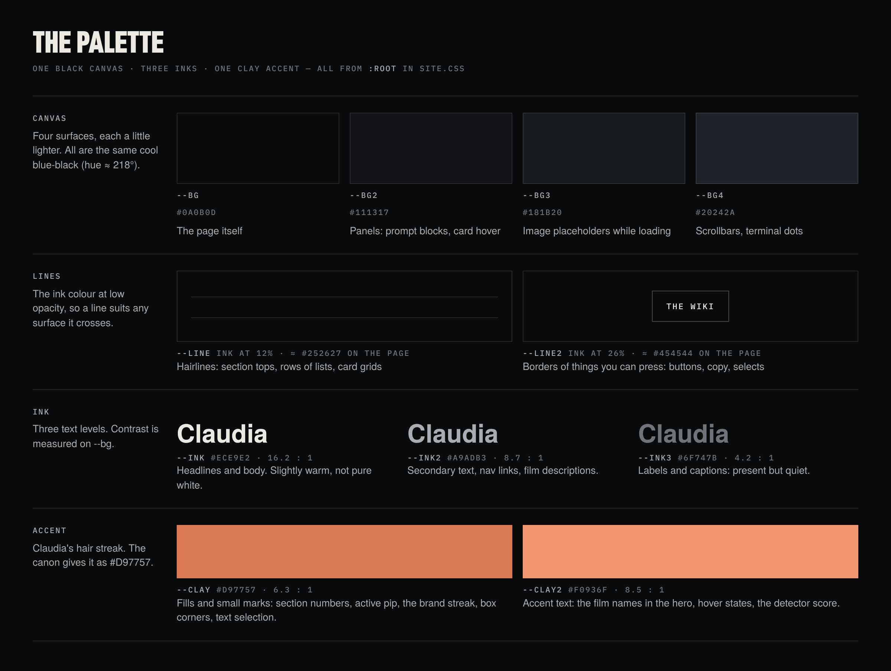

### 2.1 Tokens: one name for each colour

Every colour is defined once, as a custom property on `:root`
([L10–L21](static/css/site.css#L10-L21)):

```css
:root {
  --bg: #0a0b0d;  --bg2: #111317;  --bg3: #181b20;  --bg4: #20242a;    /* canvas */
  --line: rgba(236,233,226,.12);  --line2: rgba(236,233,226,.26);    /* lines */
  --ink: #ece9e2;  --ink2: #a9adb3;  --ink3: #6f747b;                 /* text */
  --clay: #d97757;  --clay2: #f0936f;                                 /* accent */
  /* ...fonts and sizes, see sections 3 and 4... */
  color-scheme: dark;
}
```

A custom property is a variable for CSS. You declare it with two dashes (`--ink: #ece9e2`) and read it with `var()`:

```css
.spec dt { color: var(--ink3); }          /* the labels in the canon list */
.sec-h   { border-top: 1px solid var(--line); }
```

The names describe a job: `--ink2` means "secondary text", whatever colour that turns out to be. That is what
makes the palette easy to change: edit one line in `:root` and every use follows.

Three more things to know about custom properties:

- **They inherit**, like `color` does. A value set on `:root` reaches every element; a value set on one element
  reaches only that element and its children (section 2.6 uses this).
- **They can have a fallback:** `var(--fg, 6px)` means "`--fg` if it's set, otherwise 6px" (section 5 uses this).
- **A variable that uses another variable fills it in where it's declared**, and children inherit the result
  (section 5.2 has a real example of why that matters).

`color-scheme: dark` tells the browser that the page is dark, so the parts it draws itself, such as scrollbars and
form controls, are dark too.

### 2.2 The canvas: four steps of one blue-black

| Token | Hex | Lightness | Used for |
|---|---|---|---|
| `--bg` | `#0a0b0d` | 4.5% | the page itself, the wiki cards |
| `--bg2` | `#111317` | 7.8% | prompt blocks, a wiki card under the pointer |
| `--bg3` | `#181b20` | 11.0% | the grey shown in photo frames while images load |
| `--bg4` | `#20242a` | 14.5% | the looks strip's scrollbar, the dots of the terminal window |

Each step is about 3.3 points lighter (HSL lightness), and all four share a hue of about 218° with 13–15% saturation.
So the canvas has a faint blue tint. Pure black (`#000`) is only used as the background behind media: the hero, the
video frames and the film player.

### 2.3 Lines are ink at low opacity

`--line` and `--line2` are not grey hex values. They are the ink colour (236, 233, 226) at 12% and 26% opacity. Over
`--bg` they come out as these colours, with this much contrast against it:

| Token | Looks like | Contrast | Used for |
|---|---|---|---|
| `--line` | `#252627` | 1.30 : 1 | hairlines: section tops, list rows, card grids |
| `--line2` | `#454544` | 2.05 : 1 | button borders, link underlines |

Because they are see-through, the same line works on any surface. Over `--bg2` the same `--line` becomes `#2b2d2f`:
a little lighter, with the same relation to the surface under it. A fixed grey would look heavy on one surface and
faint on another.

### 2.4 Three inks for three levels of text

Contrast is measured on `--bg`:

| Token | Hex | Contrast | Used for |
|---|---|---|---|
| `--ink` | `#ece9e2` | 16.2 : 1 | titles, body text, split-flap letters |
| `--ink2` | `#a9adb3` | 8.7 : 1 | nav links, film descriptions, card text |
| `--ink3` | `#6f747b` | 4.2 : 1 | labels and captions |

`--ink` is warm (hue 42°, like paper), while `--ink2` and `--ink3` are cool greys (hue about 215°) that match the
canvas. The main text stands out slightly warm; the quieter levels lean towards the background.

**Contrast ratios**, briefly. Each colour has a *relative luminance* L between 0 (black) and 1 (white): the red, green
and blue values are converted to light intensities, then weighted, with green counting most because our eyes are most
sensitive to it. The contrast ratio of two colours is `(L of the lighter + 0.05) / (L of the darker + 0.05)`. It runs
from 1 : 1 (the same colour) to 21 : 1 (white on black). For `--ink` on `--bg`:

```
L(--ink) = 0.816    L(--bg) = 0.0033
(0.816 + 0.05) / (0.0033 + 0.05) = 16.2
```

The WCAG accessibility guidelines ask for at least 4.5 : 1 for normal-size text (level AA). `--ink3` is 4.18 : 1 on
`--bg` and 3.95 : 1 on `--bg2`, so the small labels fall just short. That's a deliberate choice for quiet labels, and an
easy one to change (see Try it below).

### 2.5 One accent: Claudia's streak

`--clay` is `#d97757`. The character canon on the same page gives the colour of her hair streak: "One clay-orange
streak (#D97757) through the bangs". The site uses that exact colour as its only accent, so the page and the character
share a signature.

There are two clay tokens, with separate jobs (contrast on `--bg`):

| Token | Hex | Contrast | Job |
|---|---|---|---|
| `--clay` | `#d97757` | 6.3 : 1 | fills and small marks |
| `--clay2` | `#f0936f` | 8.5 : 1 | accent text and hover states |

`--clay` colours the section numbers (01, 02…), the active slideshow pip, the brand streak, the face-box corners, the
focus ring, text selection and the footer line. `--clay2` colours the film names in the hero intro, the detector
score, and a few links under the pointer, such as a wiki card's "Read →".

`--clay2` is a lighter clay, so accent words inside a paragraph stay as readable as the body text around them. The
HTML marks those words with `<em>`, and the CSS turns emphasis into colour instead of italics
([L90](static/css/site.css#L90)):

```css
.hero-copy .lede em { font-style: normal; color: var(--clay2); }
```

On clay fills the text is dark. `.btn.clay` ([L96](static/css/site.css#L96)) sets
`color: #0a0b0d`, which gives 6.3 : 1. White on the same clay would only reach 3.1 : 1.

### 2.6 Skins: colours that exist inside one film only

Each film row on the homepage carries the film's class: `<article class="film-row ev">`, `cly`, `bliss`. Rules
written under those classes affect that film only. Custom properties can be scoped the same way
([L466](static/css/site.css#L466)):

```css
.cly { --sea: #0e1a1c; --sea2: #14272a; --seal: rgba(160,205,200,.14); }
```

`--sea` exists only inside elements with the class `cly`, because custom properties inherit down the tree. The film
pages use these for CLODYSSEY's dark sea-green panels; the homepage declares them but doesn't use them.

The BLISS skin brings its own palette from Windows XP: `#0831d9` for the window frame, `#316ac5` for the selection
blue and `#ece9d8` for dialog beige. On the homepage you can see the window frame around the BLISS video (section 7.5).

### 2.7 Colours written out by hand

Not every colour goes through a token. Search `site.css` and you'll find:

- `#0a0b0d` as the text colour on filled backgrounds (the solid button, the Copy button's "Copied" state, selected
  text). It's `--bg` under another name, so if you change `--bg`, these stay as they are.
- `rgba(10,11,13,.78)` and similar: `--bg` with transparency, for the header, the hero's shade and the button
  backgrounds.
- `rgba(236,233,226,.06)` and similar: `--ink` with transparency.
- `#dcd9d2`: the text in prompt blocks and the terminal, a slightly dimmer ink (14 : 1).
- The split-flap greys `#17191d`, `#121417` and `#2a2d33` (section 5).

Plain `var()` can't add transparency to a hex colour, which is why the rgba values are written out. Modern CSS can:
`color-mix(in srgb, var(--bg) 78%, transparent)` is the same colour as `rgba(10,11,13,.78)`, and it follows the token.

### Try it: colour

All three are in the [CSS lab](https://plexormedia.github.io/claudia-gallery-study2/play/lab.html), one tap each. To
keep one, add it to `study-copy.css`.

**1. Re-tint the accent.**

```css
:root { --clay: #3fa7a0; --clay2: #63c7c0; }
```

The whole accent turns teal: section numbers, the brand streak, the slideshow pips, the face-box corners, the footer
line, text selection. What stays orange? The photos (her streak is real) and the XP window's close button, which is
Windows' own red-orange. The teal values are 6.8 : 1 and 9.8 : 1 on `--bg`, so contrast is still fine.

**2. Make the labels pass AA.**

```css
:root { --ink3: #7a7f86; }
```

4.88 : 1 on `--bg` and 4.61 : 1 on `--bg2`. The labels get a touch brighter, and the three levels of text still read
as three levels.

**3. Find the hand-written colours.** Change the canvas to a dark green:

```css
:root { --bg: #0b1a14; }
```

The page and the wiki cards turn green. Now look for what doesn't follow: the header stays blue-black once you
scroll (its background is `rgba(10,11,13,.86)`), and the hero's shade turns green only at its very bottom, because
its last colour stop is the only one written as `var(--bg)`.

---

## 3. Type

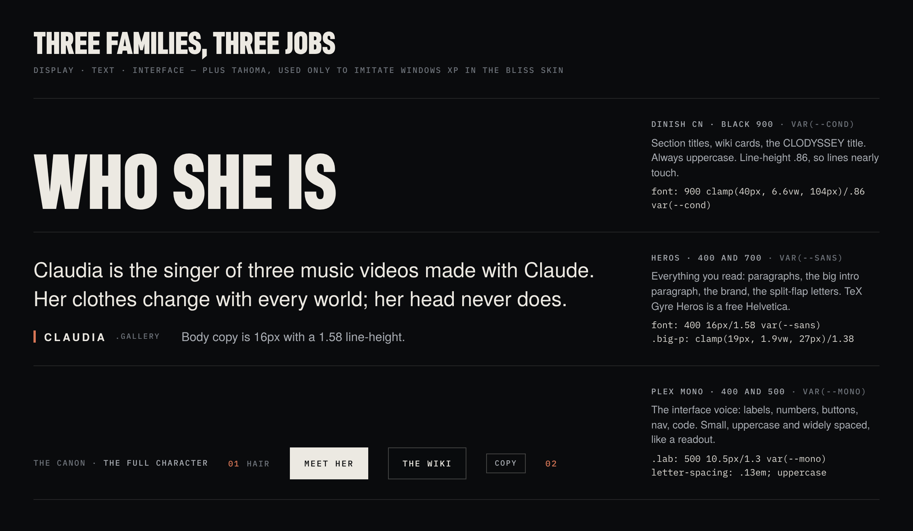

### 3.1 Three families, three jobs

| Token | Typeface | Job |
|---|---|---|
| `--cond` | DINish Condensed | display: section titles, wiki cards, CLODYSSEY |
| `--sans` | TeX Gyre Heros | reading: body text, the brand, split-flap letters |
| `--mono` | IBM Plex Mono | interface: labels, numbers, nav, buttons, code |
| `--xp` | Tahoma, from the device | the BLISS skin only, to imitate Windows XP |

The font files are DINish in its Black weight (900), Heros in Regular, Italic and Bold (700), Heros Condensed in Bold
(the fallback in 3.2), and Plex Mono in Regular (400) and Medium (500). The XP face has no file: it comes from the
device.

TeX Gyre Heros is a free Helvetica, made by the GUST e-foundry from URW's Nimbus Sans. DINish is an open-source family
based on DIN 1451, the typeface of German road signs; the page uses its condensed black cut. IBM Plex Mono is IBM's
open-source monospace.

With one family for each job, you can tell what a piece of text is (a title, something to read, a control or a piece of
data) from its shape, before you read a word of it.

### 3.2 Font stacks: what happens when a font is missing

```css
--sans: "Heros", "Helvetica Neue", Helvetica, Arial, sans-serif;
--cond: "DINish Cn", "Heros Cn", "Arial Narrow", sans-serif;
--mono: "Plex Mono", "IBM Plex Mono", ui-monospace, SFMono-Regular, Menlo, monospace;
--xp:   Tahoma, "Segoe UI", Verdana, Geneva, sans-serif;
```

A stack is a list of fonts to try in order ([L15–L18](static/css/site.css#L15-L18)). The browser works through it one
character at a time: each character comes from the first font in the list that has it.

For example, the DINish file has no arrow (→). In a title such as "Start here →" the letters would come from DINish and
the arrow from Heros Cn, the next font in the stack: a condensed bold face that sits well next to DINish. Nothing on
the page asks for Heros Cn by name; it's there to fill the gaps in DINish.

The fonts after the web fonts are look-alikes. "Helvetica Neue" stands in for Heros, which is a Helvetica clone, so if
a web font fails to load the page still looks nearly right. The XP stack has no web font at all: you get Tahoma on
Windows, and the closest of the other fonts everywhere else.

### 3.3 Loading the fonts

Each font file has an `@font-face` rule ([L2–L8](static/css/site.css#L2-L8)):

```css
@font-face {
  font-family: "Heros";                                /* the name the stacks use */
  src: url(../fonts/heros-700.woff2) format("woff2");
  font-weight: 700;                                    /* this file is the bold */
  font-display: swap;
}
```

- `font-family` is a name you choose. Three rules share the name "Heros" with different weights and styles; when an
  element asks for `font-weight: 700`, the browser picks the bold file.
- `font-display: swap` shows the text right away in a fallback font and swaps in the web font when it arrives. Without
  it, most browsers hide the text for up to three seconds while they wait.
- WOFF2 is the compressed format for web fonts. The subset files here are about 16 KB each, and the two Plex Mono
  files about 50 KB.
- A browser only downloads a file when something on the page uses that font, weight and style, or when the file is
  preloaded (next).

The page also preloads three fonts ([index.html L21–L23](index.html#L21-L23)):

```html
<link rel="preload" href="static/fonts/heros-700.woff2"
      as="font" type="font/woff2" crossorigin>
<!-- and the same for dinishcn-900.woff2 and plexmono-500.woff2 -->
```

Normally a browser finds out about a font late: it has to download the HTML, then the CSS, then lay out an element
that uses the font. `preload` starts the download as soon as the HTML is read. The three preloaded files are Heros Bold
(the split-flap letters and the brand), DINish (the section titles) and Plex Mono Medium (labels, nav and buttons).

`crossorigin` looks odd for a file on the same site, but fonts are always fetched in CORS mode, and a preload is only
reused if it was fetched the same way. Without the attribute the browser would download each font twice.

CORS is also why this copy has its own font files. The original server doesn't let other websites load its fonts,
while images and videos don't need that permission. So the photos and films still come from claudia.gallery, and the
fonts were rebuilt from each typeface's official release (see [`static/fonts/README.md`](static/fonts/README.md)).

`unicode-range` is the copy's one addition to the font rules ([L7–L8](static/css/site.css#L7-L8)). The Plex Mono files
here are IBM's complete release, with 1,049 characters. The `unicode-range` lists the characters the original's files
covered, so the browser uses Plex Mono for exactly those and falls back to the next font for anything else, as it does
on the original.

### 3.4 The label voice: one class used everywhere

```css
.lab {                                  /* L39 */
  font: 500 10.5px/1.3 var(--mono);     /* Plex Mono Medium, 10.5px */
  letter-spacing: .13em;
  text-transform: uppercase;
  color: var(--ink3);
}
.lab b { color: var(--ink2); font-weight: 500; }   /* L40 */
```

This one class gives the page its "instrument readout" voice. It's used for the section asides, the first line of
captions, the hero readout, the counters on the videos (01 / 03, 5:06), the look cards and the agent links (MCP, Skill,
llms.txt, JSON). The nav, the buttons, the film facts and the wiki card numbers repeat the same recipe in their own
rules.

An example from the looks strip:

```html
<span class="lab"><b>Escape Velocity</b> · the catwalk, the robotaxi,
  the whole film</span>
```

This shows as ESCAPE VELOCITY · THE CATWALK, THE ROBOTAXI, THE WHOLE FILM, with the film's name one step brighter.

Three techniques worth copying:

1. **Emphasis by brightness.** `<b>` inside a label keeps `font-weight: 500` and only moves up one ink,
   from `--ink3` to `--ink2`. The line keeps an even texture.
2. **Letter spacing in em.** `.13em` is 13% of the font size (1.37px at 10.5px), so it scales if the size changes.
   Small capitals need extra space between the letters to stay legible.
3. **Uppercase from CSS.** The HTML is written in normal case and `text-transform: uppercase` does the rest. To change
   the style later you only edit one rule.

### 3.5 Fluid sizes with clamp()

Most sizes on the page are written as `clamp(MIN, PREFERRED, MAX)`:

```css
.sec-h h2 { font: 900 clamp(40px, 6.6vw, 104px)/.86 var(--cond); }   /* L109 */
```

Read it as: "6.6% of the window's width, but never less than 40px and never more than 104px". The unit `vw` is 1% of
the window's width.

| Window width | 6.6vw | Font size |
|---|---|---|
| 1024px | 67.6px | 67.6px |
| 1440px | 95.0px | 95.0px |
| 1920px | 126.7px | **104px**, the maximum |

To find where a clamp() stops changing, divide MIN and MAX by the vw number written as a fraction: 40 / 0.066 = 606px
and 104 / 0.066 = 1576px. Between those two widths the title grows with the window; outside them it stays at the
limit.

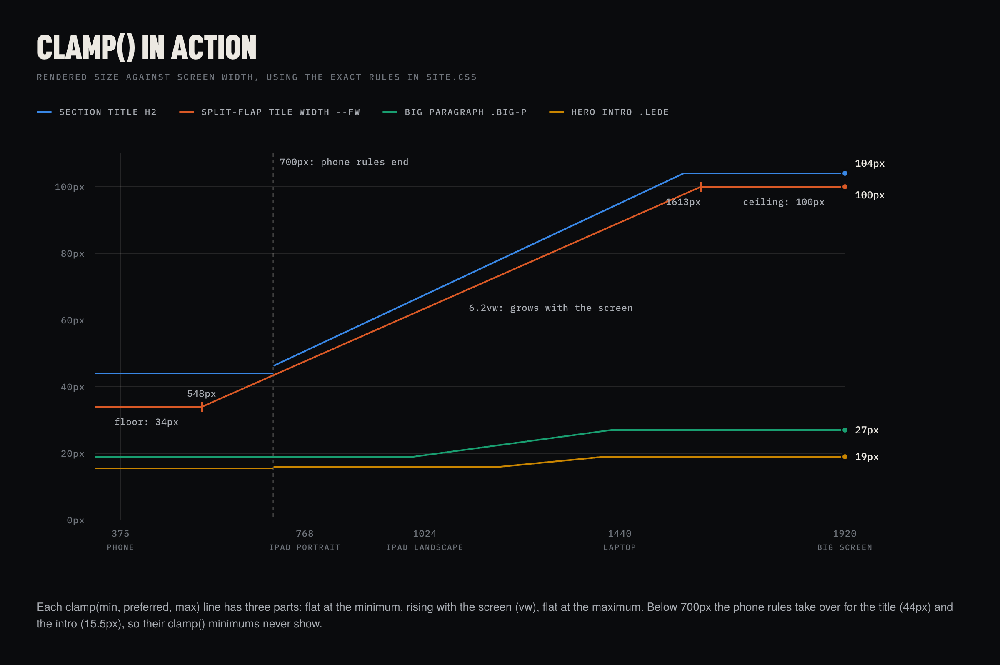

The same sizes at common widths (all values in px):

| | Rule | 375 | 768 | 1024 | 1440 | 1920 |
|---|---|---|---|---|---|---|
| Side gutter | `clamp(16px,4vw,52px)` | 16 | 30.7 | 41 | 52 | 52 |
| Section title | `clamp(40px,6.6vw,104px)` | **44** | 50.7 | 67.6 | 95 | 104 |
| Large paragraph | `clamp(19px,1.9vw,27px)` | 19 | 19 | 19.5 | 27 | 27 |
| Hero intro | `clamp(16px,1.35vw,19px)` | **15.5** | 16 | 16 | 19 | 19 |
| CLODYSSEY title | `clamp(56px,8vw,128px)` | **64** | 61.4 | 81.9 | 115.2 | 128 |
| Wiki card title | `clamp(34px,3.2vw,46px)` | 34 | 34 | 34 | 46 | 46 |
| Hero flap tile | `clamp(34px,6.2vw,100px)` | 34 | 47.6 | 63.5 | 89.3 | 100 |

The **bold** values come from the phone rules ([L516–L531](static/css/site.css#L516-L531)), which replace the clamp()
for those elements up to 700px wide.

A phone rule can make a size jump. The CLODYSSEY title is 64px in a 700px window (the phone rule) and 56px in a 701px
window (the clamp: 8vw = 56.1px). It only gets back to 64px at 800px. The BLISS title does the same, from 72px down to
60px. You only see it if you resize a window across 700px, but it shows how a breakpoint value and a clamp() can
disagree.

Vertical spacing uses `vh`, 1% of the window's height. The space above each section is `clamp(72px, 11vh, 140px)` and
the hero's text sits `clamp(28px, 7vh, 80px)` from the bottom. So spacing grows with the screen in both directions.

### 3.6 Line height and letter spacing

| Style | Size | Line height | Letter spacing |
|---|---|---|---|
| Body text (`html`) | 16px | 1.58 | normal |
| Large paragraph `.big-p` | 19–27px | 1.38 | normal |
| Section title (DINish capitals) | 40–104px | .86 | −.004em |
| CLODYSSEY title | 56–128px | .82 | −.01em |
| BLISS title (Tahoma italic) | 60–124px | .9 | −.035em |
| Wiki card title | 34–46px | .9 | normal |
| Labels `.lab` | 10.5px | 1.3 | .13em |
| Buttons and nav | 10.5–11px | 1 | .14em |
| The brand, CLAUDIA | 14px | 1 | .2em |

Three patterns:

- **Line height goes down as size goes up.** Long lines of small text need air between them to guide the eye back to
  the start of the next line; large text needs much less.
- **Display titles go below 1.** These titles are all capitals, and capitals have no descenders. In DINish a capital is
  0.69em tall, so with a line height of .86 two lines of capitals still have 0.17em of space between them.
- **Letter spacing goes the other way.** Small uppercase (labels, buttons) gets wide spacing; large titles get slightly
  negative spacing.

### 3.7 Small details

- `text-wrap: pretty` on the hero intro and the large paragraphs ([L89](static/css/site.css#L89),
  [L112](static/css/site.css#L112)) asks the browser to avoid leaving one short word alone on the last line. Browsers
  that don't support it ignore it.
- Underlines are quiet: `text-decoration-color: var(--line2)` and `text-underline-offset: .18em`
  ([L26–L27](static/css/site.css#L26-L27)). Under the pointer the underline turns clay.
- `-webkit-font-smoothing: antialiased` ([L23](static/css/site.css#L23)) only affects macOS, where it draws light text
  on dark backgrounds a little thinner.
- `text-size-adjust: 100%` (same line) asks mobile browsers not to enlarge text on their own, for example when a phone
  is turned sideways. Safari has long used the prefixed form, `-webkit-text-size-adjust`.
- `::selection { background: var(--clay); color: #0a0b0d; }` ([L28](static/css/site.css#L28)): even selected text
  uses the accent.

### Try it: type

All three are in the [CSS lab](https://plexormedia.github.io/claudia-gallery-study2/play/lab.html), one tap each. The
third switches the frame to phone width, where its media query applies.

**1. Swap the display face.**

```css
:root { --cond: "Heros Cn", "Arial Narrow", sans-serif; }
```

The titles switch to condensed Heros Bold. Compare the mood of the section titles. (They ask for weight 900; the
browser uses the nearest weight it has, 700.)

**2. Take the tracking out of the labels.**

```css
.lab { letter-spacing: 0; }
```

Small capitals without spacing look cramped. Put it back and notice how much air .13em adds.

**3. A bigger intro on phones.**

```css
@media (max-width: 700px) { .hero-copy .lede { font-size: 17px; } }
```

Without the media query the rule would apply at every width, so large screens would get 17px too.

---

## 4. Layout

### 4.1 The frame: three numbers

```css
--pad: clamp(16px, 4vw, 52px);   /* the side gutter */
--max: 1720px;                   /* the widest a section gets */
--hh: 56px;                      /* the header's height */
```

(A fourth one in `:root`, `--rowh`, is only used by the gallery pages.)

Every section is the same box ([L106](static/css/site.css#L106)):

```css
.sec {
  max-width: var(--max);
  margin: 0 auto;                                  /* centred */
  padding: clamp(72px, 11vh, 140px) var(--pad) 0;  /* space above, gutters */
}
```

So the text column is the window's width minus two gutters, up to 1720 − 2 × 52 = 1616px. In a 1440px window it is
1440 − 2 × 52 = 1336px. Most measurements in this section are taken in that 1440px window.

`--hh` appears wherever something has to clear the fixed header:

- `scroll-padding-top: calc(var(--hh) + 64px)` on `html` ([L23](static/css/site.css#L23)). When you follow a link to
  `#films`, the browser stops 120px above the section, so its title isn't hidden under the header.
- `.who figure { position: sticky; top: calc(var(--hh) + 24px); }` ([L119](static/css/site.css#L119)). The face sheet
  stays 80px from the top of the window while you scroll through the canon list beside it.
- The phone menu drops down from just under the header: `inset: var(--hh) 0 auto` ([L57](static/css/site.css#L57)).

### 4.2 The section header: auto, 1fr, auto

Every section starts the same way ([index.html L67](index.html#L67)):

```html
<header class="sec-h">
  <span class="idx">01</span>
  <h2>Who she is</h2>
  <p class="aside lab">The canon · <a href="…">the full character</a></p>
</header>
```

The CSS ([L107–L110](static/css/site.css#L107-L110)), without the font and colour declarations:

```css
.sec-h {
  display: grid;
  grid-template-columns: auto 1fr auto;
  align-items: end;
  gap: 18px;
  border-top: 1px solid var(--line);
  padding-top: 14px;
  margin-bottom: clamp(28px, 4vw, 52px);
}
.sec-h .idx   { align-self: start; padding-top: 6px; }
.sec-h .aside { align-self: start; padding-top: 4px;
                max-width: 30em; text-align: right; }
```

- An `auto` column is as wide as its content: 16.3px for the number "01" and 230px for the aside.
- A `1fr` column takes whatever is left: 1336 − 16.3 − 230 − 2 × 18 = 1053.8px.
- `align-items: end` sets the title at the bottom of the row. The number and the aside override it with
  `align-self: start`, so they hang from the line above, like a footnote marker and a caption.

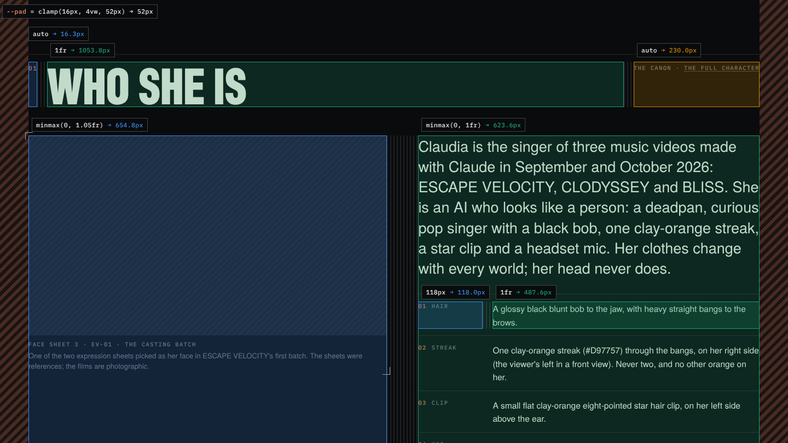

*Who she is at 1440px. The coloured boxes are the grid columns, labelled with their CSS and their measured width; the
hatched bands are the gutters.*

Under 760px the aside moves to a row of its own ([L111](static/css/site.css#L111)):

```css
@media (max-width: 760px) {
  .sec-h { grid-template-columns: auto 1fr; }
  .sec-h .aside { grid-column: 1 / -1; text-align: left; }
}
```

`grid-column: 1 / -1` means "from the first column line to the last one": the full width, whatever the number of
columns. Negative line numbers count from the end.

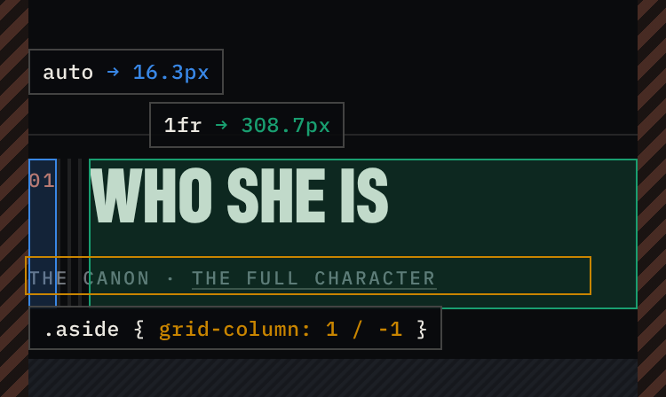

### 4.3 Two columns and the fr unit

```css
/* L118, L148 and L213 */
.who      { grid-template-columns: minmax(0, 1.05fr) minmax(0, 1fr); }
.film-row { grid-template-columns: minmax(0, 1.5fr) minmax(0, 1fr); }
.agents   { grid-template-columns: minmax(0, 1.2fr) minmax(0, 1fr); }
```

The gaps between the columns are fluid too: `clamp(24px, 4vw, 72px)` for `.who` and `clamp(24px, 4vw, 64px)` for the
other two. How `fr` shares out the space, for `.who` in a 1440px window:

1. Start with the text column: 1336px.
2. Take away the gap, 4vw = 57.6px: 1278.4px are left.
3. Add up the fractions: 1.05 + 1 = 2.05 shares, so one share is 1278.4 / 2.05 = 623.6px.
4. The left column gets 1.05 shares, 654.8px. The right column gets one share, 623.6px.

The film rows work the same way: 1.5 + 1 = 2.5 shares of 1278.4px, so the video gets 767.0px and the text 511.4px.

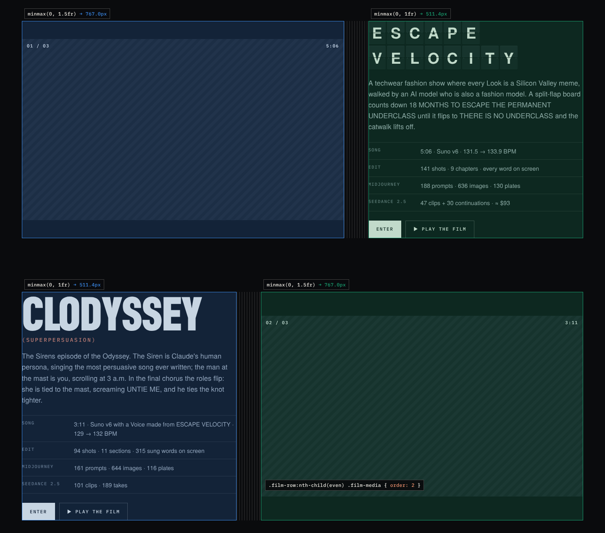

Every second film row swaps sides ([L149–L150](static/css/site.css#L149-L150)):

```css
.film-row:nth-child(even) {
  grid-template-columns: minmax(0, 1fr) minmax(0, 1.5fr);
}
.film-row:nth-child(even) .film-media { order: 2; }
```

The first rule flips the column widths, narrow first. `order: 2` moves the video after the text. The HTML is the same
for every film, video first, which is also the order a screen reader follows. Under 900px all three rows stack into a
single column, and `order: 0` puts the video back on top ([L151](static/css/site.css#L151)). On the film rows,
`align-items: center` centres the video vertically against the text beside it.

#### Why `minmax(0, 1fr)`?

A plain `1fr` is short for `minmax(auto, 1fr)`: the column can't get narrower than the narrowest its content can be.
One long thing that can't wrap, such as a URL in a `<pre>`, pushes its column wider than its share, and the proportions
break. `minmax(0, 1fr)` lets the column shrink as far as it needs to, so the proportions always hold.

Measured in a 600px-wide grid with a 20px gap, with a long URL in a `<pre>` in the first column:

| Columns | Result |
|---|---|
| `1fr 1fr` | 597px and 68px. The URL wins, and the grid sticks out of its 600px box |
| `minmax(0, 1fr) minmax(0, 1fr)` | 290px and 290px. The URL overflows its own column instead |

Add `overflow: auto` to the `<pre>` and the URL scrolls inside its column. On this page the long content wraps anyway
(prompt blocks use `word-break: break-word`, the terminal `word-break: break-all`), so `minmax(0, …)` is a safety net.

#### Fixed label columns

Lists of facts give their first column a fixed width: the canon list, the film facts and the agent links.

```css
.spec > div           { grid-template-columns: 118px 1fr; }   /* L122 */
.film-copy .facts div { grid-template-columns: 110px 1fr; }   /* L156 */
.kv a, .kv div        { grid-template-columns: 150px 1fr; }   /* L216 */
```

Each row is its own small grid. Because every row uses the same fixed width, the values line up down the list like a
table column, without the markup of a table.

### 4.4 The looks strip: a row that runs off the screen

The looks are a sideways-scrolling row ([L185–L186](static/css/site.css#L185-L186)):

```css
.strip {
  display: grid;
  grid-auto-flow: column;                        /* new cards make new columns */
  grid-auto-columns: clamp(190px, 19vw, 290px);  /* each this wide */
  gap: 14px;
  overflow-x: auto;                              /* scroll sideways */
  overscroll-behavior-x: contain;                /* stop at the ends */
  scroll-snap-type: x proximity;                 /* settle on a nearby card */
  padding: 0 var(--pad) 18px;
  margin: 0 calc(var(--pad) * -1);               /* the bleed */
  /* ...plus a thin scrollbar in --bg4 */
}
.look { display: block; scroll-snap-align: start; }   /* where cards settle */
```

The bleed works like this. The section has a gutter on each side. The strip's negative margin pulls it out over both
gutters, to the edges of the screen. Its own padding then moves the first card back in by one gutter. The intended
result: the first card lines up with the title above it, and when you scroll, the cards slide all the way to the edge
of the screen instead of being cut off at the gutter.

Two things get in the way:

- Above 1720px the sections stop growing (`--max`), so the strip stops at the section's edges. In a 1920px window
  that is 100px short of each side of the screen.
- In Chrome, the first card doesn't start on the gutter. Snapping puts a card's left edge on the strip's left edge,
  which is the edge of the screen. For the first card that only takes a scroll of one gutter, close enough for
  `proximity` snapping, so Chrome scrolls the strip by one gutter as soon as it's laid out: the first card touches the
  edge of the screen, and the start of its label is cut off. (Check what Safari does on your iPad. Browsers differ on
  whether they snap before your first swipe.)

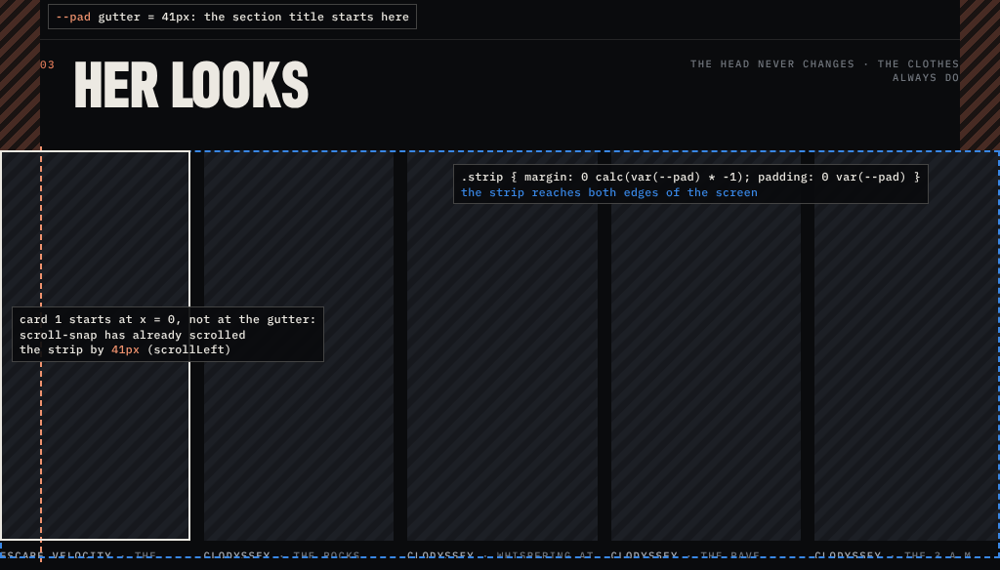

The fix is one line. `scroll-padding` tells snapping to keep a margin:

```css
.strip { scroll-padding-inline: var(--pad); }
```

With it, the first card sits on the gutter when the page loads (the strip's `scrollLeft` is 0 instead of 41px in a
1024px window), and cards come to rest on the gutter after a swipe as well. The strip has one more problem, in its
cards; section 4.9 takes it apart.

### 4.5 The wiki cards: one line between every card

```css
.guides {                                    /* L195 */
  display: grid;
  grid-template-columns: repeat(auto-fill, minmax(300px, 1fr));
  border-top: 1px solid var(--line);
  border-left: 1px solid var(--line);
}
.guide {                                     /* L196 */
  display: flex;
  flex-direction: column;
  min-height: 250px;
  padding: 26px 26px 28px;
  border-right: 1px solid var(--line);
  border-bottom: 1px solid var(--line);
  /* ...plus a --bg background that turns --bg2 under the pointer */
}
.guide .go { margin-top: auto; }             /* L201: "Read →" */
```

- `repeat(auto-fill, minmax(300px, 1fr))` reads "as many columns as fit, each at least 300px wide, then share out any
  leftover space equally". The number of columns follows the window without a single media query: 1 at 375px, 2 at
  768px, 3 at 1024px, 4 at 1440px, 5 at 1920px.
- **The border trick.** If every card drew all four borders, each line between two cards would be 2px thick, two
  borders side by side. Instead the grid draws the top and left edges, and each card draws its own right and bottom
  edges. Every line is drawn exactly once, whatever the number of columns, and when the last row isn't full, the
  empty space has no lines.
- Each card is a flex column, and `margin-top: auto` on "Read →" pushes it to the bottom. Cards in the same grid row
  are stretched to the same height, so the links line up across the row whatever the length of the texts.

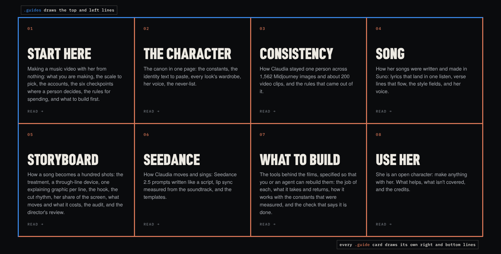

### 4.6 The hero: five layers in one box

```css
.hero {                                      /* L75 */
  position: relative;
  height: 100svh; min-height: 600px;
  overflow: hidden;
  background: #000;
}
```

From back to front:

1. **Three slides**, each `position: absolute; inset: 0`, so all three cover the whole hero, one on top of the other.
   Only the slide with the class `on` is visible (`opacity: 1`). The others are at 0, and they cross-fade over 1.8
   seconds ([L76–L77](static/css/site.css#L76-L77)).
2. **Inside each slide**, the photo (`object-fit: cover`, section 6) and its face box.
3. **The shade**, a gradient over all the slides (below).
4. **The hero copy**, raised with `z-index: 3` and pinned near the bottom: the split-flap, the intro and the buttons on
   the left, the readout on the right (`grid-template-columns: minmax(0, 1fr) auto`, [L88](static/css/site.css#L88)).
5. **The header**, fixed above the whole page with `z-index: 60`.

The shade ([L80](static/css/site.css#L80)):

```css
.hero .shade {
  position: absolute; inset: 0; pointer-events: none;
  background: linear-gradient(180deg,
    rgba(10,11,13,.5) 0,      /* top: darker, so the header can be read */
    rgba(10,11,13,0) 22%,     /* clear */
    rgba(10,11,13,0) 48%,     /* still clear: this is where the face is */
    rgba(10,11,13,.86) 88%,   /* dark behind the text */
    var(--bg) 100%);          /* exactly the page colour */
}
```

Because the gradient ends in exactly `--bg`, the hero melts into the page without a visible edge.
`pointer-events: none` lets taps and clicks pass through the shade to whatever is under it.

`100svh` deserves a note. `svh` means "small viewport height": the height of the window while a phone's browser bars
are showing. Plain `100vh` is the taller height with the bars hidden, so on a phone a `100vh` hero is partly covered by
the bars, and so is the text at its bottom. `min-height: 600px` keeps the hero from getting too short, for example on a
phone held sideways.

### 4.7 The header: see-through, then solid

```css
.site-h {                                         /* L44 */
  position: fixed; inset: 0 0 auto; z-index: 60;
  height: var(--hh);
  background: linear-gradient(rgba(10,11,13,.78), rgba(10,11,13,0));
  border-bottom: 1px solid transparent;
  transition: background .35s, border-color .35s;
  /* ...plus a flex row for the brand, the tag and the nav */
}
.site-h.solid, .site-h.always {                   /* L45 */
  background: rgba(10,11,13,.86);
  backdrop-filter: blur(16px) saturate(1.15);
  border-bottom-color: var(--line);
}
```

```js
// site.js L10–L14
const hdr = $(".site-h");
if (hdr && !hdr.classList.contains("always")) {
  const on = () => hdr.classList.toggle("solid", scrollY > 40);
  addEventListener("scroll", on, { passive: true }); on();
}
```

Over the hero the header is only a soft gradient. Once you scroll more than 40px, the script adds the class `solid`:
a nearly opaque bar that blurs whatever passes under it (`backdrop-filter`), with a hairline at the bottom. The
transition fades in the new colour and the hairline over 0.35 seconds. The same style also serves a second class,
`always`, which keeps a header solid from the start; the script leaves such a header alone.

- `inset: 0 0 auto` is short for top 0, right 0, bottom auto and left 0: pinned to the top, the full width of the
  window.
- `classList.toggle("solid", condition)` adds the class when the condition is true and removes it when it's false.
- `{ passive: true }` promises the browser that the listener will never cancel the scroll, so scrolling doesn't have to
  wait for it.
- The final `on()` runs the check once at load, for a page that opens already scrolled (after a reload, for example).

### 4.8 Breakpoints

| Window width | What changes | Where |
|---|---|---|
| 960px and under | the nav folds into a Menu button | [L55–L60](static/css/site.css#L55-L60) |
| 900px and under | Who she is, the film rows and For agents stack into one column | [L120](static/css/site.css#L120), [L151](static/css/site.css#L151), [L214](static/css/site.css#L214) |
| 860px and under | the footer goes from 4 columns to 2 | [L228](static/css/site.css#L228) |
| 760px and under | the hero readout moves under the intro; section asides get their own row | [L103](static/css/site.css#L103), [L111](static/css/site.css#L111) |
| 700px and under | phone type sizes | [L516–L531](static/css/site.css#L516-L531) |
| 374px and under | the copy's "Study copy" tag shortens to "Copy" | [`study-copy.css`](static/css/study-copy.css) |

The stylesheet is written desktop-first: the main rules describe the wide layout, and `max-width` media queries adjust
it for narrower windows. There are only a few breakpoints because most things are already fluid (clamp(), `fr`,
`auto-fill`); media queries are kept for real changes of structure.

### 4.9 Case study: a bug in the looks strip

On the live site the looks cards don't look the way their CSS describes. The photos fill each whole card, the labels
are cut in half at the bottom of the strip, and the titles (Look 00, The Siren and so on) can't be seen at all. Working
out why teaches three CSS rules at once.

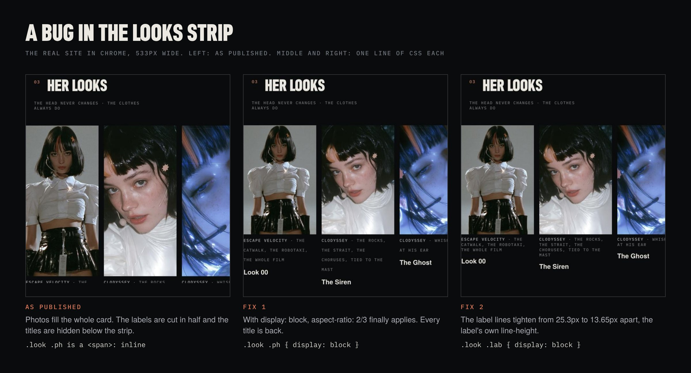

The intention is clear from the CSS ([L187–L191](static/css/site.css#L187-L191)): a photo in a 2:3 frame, then a
label, then a title.

```css
.look .ph     { position: relative; aspect-ratio: 2/3; overflow: hidden;
                background: var(--bg3); }
.look .ph img { width: 100%; height: 100%; object-fit: cover; }
.look h3      { font: 700 17px/1.2 var(--sans); margin-top: 12px; }
.look .lab    { margin-top: 6px; }
```

And the HTML of one card ([index.html L132–L136](index.html#L132-L136)):

```html
<a class="look" href="…">
  <span class="ph"></span>
  <span class="lab"><b>Escape Velocity</b> · the catwalk, the robotaxi, …</span>
  <h3>Look 00</h3>
</a>
```

What happens, in four steps. The numbers are for a 533px window, where each card is 190px wide.

1. **`.ph` is a `<span>`, so it is an inline box.** `aspect-ratio` doesn't apply to inline boxes, and neither does
   `overflow`. Both declarations are ignored, so the 2:3 frame never exists.
2. **The photo escapes the span.** The `img` is `display: block`, from the reset at the top of the stylesheet
   ([L25](static/css/site.css#L25)). A block inside an inline span is laid out as if the span weren't there, and its
   percentage sizes are measured against the nearest block container: the card, `a.look`. So `width: 100%` is the
   card's width, and `height: 100%` is the card's height.
3. **Every card is as tall as the tallest card.** The strip is a single grid row, and grid items stretch to fill their
   row. To size the row, the grid first measures each card with its photo at its natural shape (while the card's
   height is still unknown, a percentage height counts as `auto`). The tallest card is a BLISS look: a portrait photo,
   285px tall at 190px wide, plus three label lines (3 × 25.3px) and the title (12px of margin and a 20.4px line),
   393px in all. Every card is stretched to 393px, and a stretched grid item counts as having a definite height. Now
   `height: 100%` can be resolved, and every photo becomes 393px tall: the whole card.
4. **What follows the photo spills out of the card.** The label and the title start where the card ends. The strip
   scrolls sideways (`overflow-x: auto`), and CSS doesn't let a box scroll in one direction while it spills over in the
   other, so its `overflow-y` becomes `auto` as well. The strip therefore clips everything below its 18px of bottom
   padding, which leaves room for the top half of the first label line and none of the titles. (The strip can even be
   scrolled up and down by 117px: that's where the titles are.)

The same cause has three smaller effects:

- The label's lines are 25.3px apart, although its own line height is 1.3 × 10.5px = 13.65px. An inline span's lines
  belong to the card, and every line in a block is at least as tall as the block's own font size and line height:
  16px × 1.58 = 25.3px. That invisible minimum is called the strut.
- `margin-top: 6px` on the label does nothing, because top and bottom margins don't apply to inline boxes.
- The hover zoom (`transform: scale(1.03)`, [L189](static/css/site.css#L189)) isn't clipped, since the span's
  `overflow: hidden` is ignored. The photo grows a few pixels past the card's edges (4px in a 1440px window).

Two one-line fixes:

```css
.look .ph  { display: block; }   /* fix 1: aspect-ratio and overflow apply */
.look .lab { display: block; }   /* fix 2: its own line height, and its margin */
```

Fix 1 alone gives every photo its 2:3 frame (190 × 285px), brings back the labels and the titles, and clips the hover
zoom. Fix 2 tightens the label's lines from 25.3px to 13.65px apart and applies the 6px margin. With both, every card
is 378px tall and everything in it is visible.

The lesson: an element's tag sets its default `display`, and its `display` decides which properties work. On a plain
inline box, `aspect-ratio`, `overflow`, `width`, `height` and vertical margins are all ignored. A `<span>` that should
behave like a box needs `display: block` or `inline-block`.

This copy keeps the bug, to stay faithful to the original. To fix it here, add the two lines above to
`study-copy.css`, together with the `scroll-padding-inline` line from section 4.4.

### Try it: layout

All four are in the [CSS lab](https://plexormedia.github.io/claudia-gallery-study2/play/lab.html), one tap each. Its
frame can also be as wide as an iPad in portrait (820px) or in landscape (1180px), so you can check each result in both
orientations without turning your iPad.

**1. Fix the looks strip.** Add the three lines from 4.4 and 4.9 to `study-copy.css`, then compare the strip on your
iPad in both orientations.

**2. Give the films equal halves.**

```css
@media (min-width: 901px) {
  .film-row, .film-row:nth-child(even) {
    grid-template-columns: minmax(0, 1fr) minmax(0, 1fr);
  }
}
```

The media query matters. Without it, your rule would also replace the one-column layout under 900px: rules in
`site.css`'s media query have the same specificity, and `study-copy.css` comes later, so it would win.

**3. A narrower page.**

```css
:root { --max: 960px; }
```

On an iPad in landscape the sections now stop at 960px and centre themselves, with wide margins on both sides.

**4. More wiki columns.**

```css
.guides { grid-template-columns: repeat(auto-fill, minmax(240px, 1fr)); }
```

An iPad in landscape (about 1180px wide) now gets 4 columns instead of 3, and in portrait (about 820px) 3 instead
of 2.

---

## 5. The split-flap board

### 5.1 The HTML: the letters are already there

```html
<!-- index.html L53: a single line in the file -->
<div class="flaps" data-flap role="img" aria-label="Claudia">
  <span class="flap" aria-hidden="true">C</span>
  <span class="flap" aria-hidden="true">L</span>
  <span class="flap" aria-hidden="true">A</span>
  <span class="flap" aria-hidden="true">U</span>
  <span class="flap" aria-hidden="true">D</span>
  <span class="flap" aria-hidden="true">I</span>
  <span class="flap" aria-hidden="true">A</span>
</div>
```

Three decisions are worth noticing:

- **The final word is in the HTML.** Without JavaScript, or with reduced motion turned on, you see CLAUDIA. The
  script only adds the clatter on top, so nothing breaks if it doesn't run.
- **`data-flap` marks the boards to animate.** The script looks for `.flaps[data-flap]`, so a board without the
  attribute stays still.
- **One accessible name.** For a screen reader, seven separate letters (or random letters in the middle of the
  animation) would be noise. `role="img"` with `aria-label="Claudia"` turns the board into a single image called
  "Claudia", and `aria-hidden="true"` hides the individual tiles.

The ESCAPE VELOCITY title ([index.html L92–L95](index.html#L92-L95)) is two boards. The second has `data-delay="220"`:
each board starts when it comes into view (section 5.3), and VELOCITY then waits another 220ms. When both come into
view together, VELOCITY follows ESCAPE by 220ms. Their wrapper has `role="heading" aria-level="3" aria-label="ESCAPE VELOCITY"`,
so for a screen reader it is still a heading.

### 5.2 The CSS: one tile, one variable

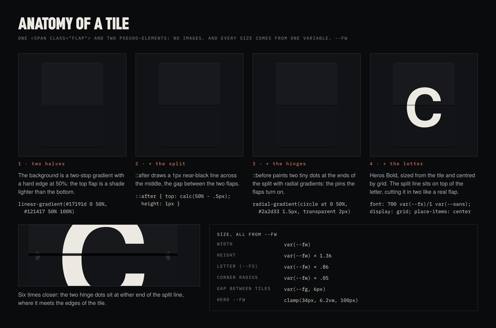

The whole board takes ten lines of CSS ([L63–L72](static/css/site.css#L63-L72)), here with comments:

```css
.flaps {                              /* the board */
  display: flex; flex-wrap: wrap;
  gap: var(--fg, 6px);                /* --fg, or 6px if it isn't set */
  --fw: clamp(34px, 6.2vw, 100px);    /* flap width: the one real size */
  --fs: calc(var(--fw) * .86);        /* the letter size */
}
.flap {                               /* one tile */
  position: relative;
  width: var(--fw);
  height: calc(var(--fw) * 1.36);
  display: grid; place-items: center; /* centre the letter */
  background: linear-gradient(#17191d 0 50%, #121417 50% 100%);
  border-radius: calc(var(--fw) * .05);
  font: 700 var(--fs)/1 var(--sans);  /* Heros Bold */
  color: var(--ink);
  box-shadow: inset 0 1px 0 rgba(255,255,255,.05),  /* highlight on top */
              0 1px 0 rgba(0,0,0,.7);               /* dark line below */
  overflow: hidden;
}
.flap::after {                        /* the split */
  content: ""; position: absolute; left: 0; right: 0;
  top: calc(50% - .5px); height: 1px;
  background: rgba(0,0,0,.85);
}
.flap::before {                       /* the two hinge pins */
  content: ""; position: absolute; left: 3px; right: 3px;
  top: calc(50% - 2px); height: 4px;
  background: radial-gradient(circle at 0 50%,    #2a2d33 1.5px, transparent 2px),
              radial-gradient(circle at 100% 50%, #2a2d33 1.5px, transparent 2px);
}
/* a blank tile, for a space */
.flap.sp { background: transparent; box-shadow: none; }
.flap.sp::after, .flap.sp::before { display: none; }
/* the flicker, switched on by the script */
.flap.tick { animation: flick .07s steps(1); }
@keyframes flick { 50% { color: var(--ink2); } }
/* smaller boards */
.flaps.sm { --fw: clamp(20px, 2.3vw, 34px); --fg: 3px; }
.flaps.xs { --fw: clamp(15px, 1.6vw, 22px); --fg: 2px; }
```

Piece by piece:

**One variable.** `--fw` (flap width) is the only real size. The height is 1.36 × `--fw`, the letter .86 × `--fw` and
the corner radius .05 × `--fw`. Change `--fw` and the whole tile scales, which is what `.sm` and `.xs` do (they also tighten the gap with `--fg`). The hero's
tiles at common widths:

| Window | Tile width | Height | Letter | Corner radius |
|---|---|---|---|---|
| 375px | 34px | 46.2px | 29.2px | 1.7px |
| 768px | 47.6px | 64.8px | 40.9px | 2.4px |
| 1024px | 63.5px | 86.3px | 54.6px | 3.2px |
| 1440px | 89.3px | 121.4px | 76.8px | 4.5px |
| 1920px | 100px | 136px | 86px | 5px |

**Two halves from one gradient.** `linear-gradient(#17191d 0 50%, #121417 50% 100%)` gives the first colour the range
0 to 50% and the second 50% to 100%. Where two colours meet at the same point there's no room for a blend, so you get a
hard edge: the upper flap a shade lighter than the lower one, as if lit from above.

**The split.** `::after` is a 1px line across the middle. `top: calc(50% - .5px)` centres the line exactly on the edge
between the two halves.

**The hinge pins.** `::before` is a 4px strip, 3px in from each side, painted with two radial gradients: dots of 1.5px
radius (fading out by 2px, which smooths their edges) centred on the strip's left and right ends. Half of each dot
falls outside the strip and isn't painted, so you get two tiny half-dots where the split meets the sides. The zoomed
view in the figure shows them.

**The letter.** `display: grid; place-items: center` centres the text both ways. A line height of 1 keeps the text box
tight, so the centring is accurate.

**The flicker.** Each time the script shows a new letter, it adds the class `tick`. `animation: flick .07s steps(1)`
with a single keyframe at 50% means: full ink for 35ms, then `--ink2` for 35ms, then back. `steps(1)` makes the colour
jump instead of fading, like a flap catching the light as it drops.

> [!WARNING]
> **`--fw` belongs on the board.** `--fs` is declared on `.flaps` as `calc(var(--fw) * .86)`, so its `var(--fw)` is
> filled in there, with the board's value, and the tiles inherit the result. A new `--fw` on a tile no longer reaches
> it. Measured in a 1440px window: `--fw: 50px` on one tile makes that tile 50 × 68px but leaves its letter at 76.8px. On the board, the same
> value gives 50 × 68px tiles with 43px letters.

The ESCAPE VELOCITY boards have the class `sm`, but `.t-ev .flaps` ([L162](static/css/site.css#L162)) sets their
`--fw` again, to `clamp(22px, 2.9vw, 46px)`. Both selectors are worth two classes (the same specificity), so the rule
that comes later in the file wins: L162 beats L71.

### 5.3 The JavaScript, line by line

The script ([`site.js` L18–L36](static/js/site.js#L18-L36)), with its long lines split and numbered comments added:

```js
const CH = "ABCDEFGHIJKLMNOPQRSTUVWXYZ0123456789";   // what a tile can show

function flapBoard(el) {
  if (RM) return;                                                // (1)
  const start = performance.now() + (+el.dataset.delay || 0);    // (2)
  $$(".flap", el).forEach((d, i) => {
    const c = d.textContent;            // the real letter, from the HTML
    if (!c) return;                     // an empty tile doesn't move
    const stop = start + 380 + i * 95 + Math.random() * 260;     // (3)
    const step = now => {                                        // (4)
      if (now >= stop) { d.textContent = c; return; }
      if (now >= start) {
        d.textContent = CH[(Math.random() * CH.length) | 0];     // (5)
        d.classList.remove("tick");                              // (6)
        void d.offsetWidth;
        d.classList.add("tick");
      }
      setTimeout(() => requestAnimationFrame(step), 55);         // (7)
    };
    requestAnimationFrame(step);
  });
}

const flapIO = new IntersectionObserver(es => es.forEach(e => {  // (8)
  if (e.isIntersecting) { flapIO.unobserve(e.target); flapBoard(e.target); }
}), { threshold: .6 });
$$(".flaps[data-flap]").forEach(el =>
  el.closest(".hero") ? flapBoard(el) : flapIO.observe(el));
```

`$$` is the script's shortcut for `querySelectorAll`, returning an array ([L5](static/js/site.js#L5)).

**(1) Reduced motion.** `RM` ([L6](static/js/site.js#L6)) is
`matchMedia("(prefers-reduced-motion: reduce)").matches`: true when the person has asked their device for less motion
(on an iPad: Settings › Accessibility › Motion › Reduce Motion). Then the board doesn't animate at all, and the letters
from the HTML stay.

**(2) The start time.** `performance.now()` is a precise clock, in milliseconds since the page started loading.
`data-delay` arrives as text ("220"), and the `+` in front turns it into a number. On a board without the attribute,
`+undefined` is `NaN`, and `NaN || 0` is 0.

**(3) Each tile's stop time:** 380ms after the start, plus 95ms for each position, plus a random 0 to 260ms. Section
5.4 shows what that does.

**(4) The loop.** `requestAnimationFrame` calls `step` with `now`, a timestamp on the same clock as
`performance.now()`. Once `now` passes `stop`, the tile gets its real letter and `step` returns without scheduling
itself again, which ends that tile's loop. Before `start` (on a delayed board) it only waits.

**(5) A random letter.** `Math.random() * CH.length` is a decimal between 0 and 36. `| 0` is a bitwise OR with zero,
which has the side effect of dropping the decimals, leaving a whole number from 0 to 35. For positive numbers it does
the same as `Math.floor()`.

**(6) Restarting a CSS animation.** Removing a class and adding it back in the same moment does nothing: the browser
only looks at the result, and the result hasn't changed. Reading `offsetWidth` in between forces the browser to apply
the removal right away (a *reflow*), so the class that comes back counts as new and the animation starts over. `void`
throws away the value that was read.

**(7) The pace.** Wait 55ms, then wait for the next frame. So a tile changes about every 55 to 72ms (14 to 18 letters a
second), and each change happens exactly when the screen is redrawn. `requestAnimationFrame` also pauses in a
background tab: if you switch tabs during the animation, the tiles stop, and when you come back they land at once,
because they are already past `stop`.

**(8) Start when seen.** Boards in the hero start right away. The others are handed to an `IntersectionObserver`, which
calls back once at least 60% of a board is on screen (`threshold: .6`). `unobserve` makes sure each board plays only
once.

### 5.4 The timing, drawn

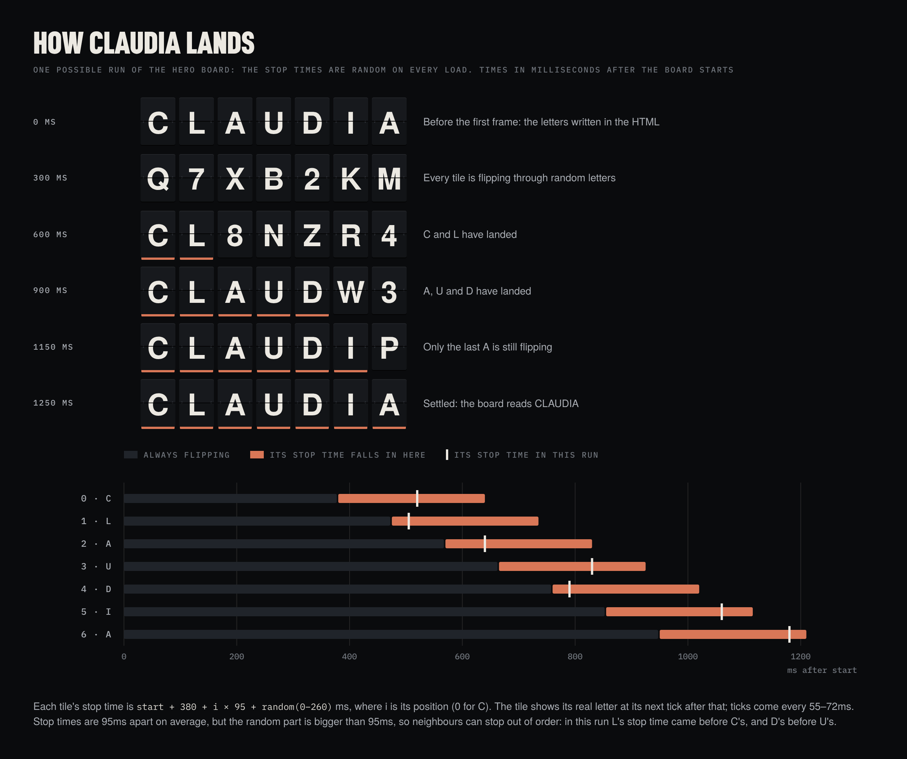

With the start at 0:

| Tile | Letter | Earliest stop | Latest stop |
|---|---|---|---|
| 0 | C | 380ms | 640ms |
| 1 | L | 475ms | 735ms |
| 2 | A | 570ms | 830ms |
| 3 | U | 665ms | 925ms |
| 4 | D | 760ms | 1020ms |
| 5 | I | 855ms | 1115ms |
| 6 | A | 950ms | 1210ms |

A tile doesn't land at the exact millisecond of its stop time: it shows its real letter at its next tick after it, up
to about 70ms later. And because the tiles of a board start together and wait the same 55ms, they tick at nearly the
same moments, so two tiles whose stop times fall between the same two ticks land together.

Each window is 260ms wide, and each starts 95ms after the one before. Because the windows are wider than the step
between them, they overlap, and neighbours can stop out of order: in the run drawn above, L's stop time came before
C's, and D's before U's. The base order still runs left to right, so the word seems to arrive from the left, but
loosely, like a real board where every drum spins on its own. The whole word settles between about 0.95 and 1.3
seconds after the start: the last tile's stop time, plus up to one tick.

The [split-flap playground](https://plexormedia.github.io/claudia-gallery-study2/play/flaps.html) draws this chart for
every run, with the real stop and landing times, and puts each of these numbers on a slider. Slow motion plays a run
five times slower, so you can watch the tiles land.

### 5.5 Build your own

This is a complete page with one board and an Again button. Paste it into an empty `.html` file and open it in a
browser, or into the HTML panel of an online editor such as CodePen, which works on an iPad.

```html
<!doctype html>
<meta charset="utf-8">
<title>Split-flap</title>
<style>
  body {
    margin: 0; min-height: 100vh;
    display: grid; place-content: center; gap: 24px;
    background: #0a0b0d; color: #ece9e2;
    font-family: "Helvetica Neue", Arial, sans-serif;
  }
  .flaps {
    display: flex; gap: var(--fg, 6px);
    --fw: clamp(34px, 6.2vw, 100px); --fs: calc(var(--fw) * .86);
  }
  .flap {
    position: relative; width: var(--fw); height: calc(var(--fw) * 1.36);
    display: grid; place-items: center; overflow: hidden;
    background: linear-gradient(#17191d 0 50%, #121417 50% 100%);
    border-radius: calc(var(--fw) * .05);
    font: 700 var(--fs)/1 "Helvetica Neue", Arial, sans-serif;
    box-shadow: inset 0 1px 0 rgba(255,255,255,.05), 0 1px 0 rgba(0,0,0,.7);
  }
  .flap::after {
    content: ""; position: absolute; left: 0; right: 0;
    top: calc(50% - .5px); height: 1px; background: rgba(0,0,0,.85);
  }
  .flap::before {
    content: ""; position: absolute; left: 3px; right: 3px;
    top: calc(50% - 2px); height: 4px;
    background: radial-gradient(circle at 0 50%, #2a2d33 1.5px, transparent 2px),
                radial-gradient(circle at 100% 50%, #2a2d33 1.5px, transparent 2px);
  }
  .flap.tick { animation: flick .07s steps(1); }
  @keyframes flick { 50% { color: #a9adb3; } }
  button {
    justify-self: start; padding: 12px 16px; cursor: pointer;
    font: 500 11px/1 ui-monospace, Menlo, monospace;
    letter-spacing: .14em; text-transform: uppercase;
    color: inherit; background: none; border: 1px solid rgba(236,233,226,.26);
  }
</style>

<div class="flaps" role="img" aria-label="Claudia">
  <span class="flap" aria-hidden="true">C</span>
  <span class="flap" aria-hidden="true">L</span>
  <span class="flap" aria-hidden="true">A</span>
  <span class="flap" aria-hidden="true">U</span>
  <span class="flap" aria-hidden="true">D</span>
  <span class="flap" aria-hidden="true">I</span>
  <span class="flap" aria-hidden="true">A</span>
</div>
<button type="button">Again</button>

<script>
  const CH = "ABCDEFGHIJKLMNOPQRSTUVWXYZ0123456789";
  const RM = matchMedia("(prefers-reduced-motion: reduce)").matches;

  function flapBoard(board) {
    if (RM) return;
    const run = (board.run = (board.run || 0) + 1);  // new: this run's number
    const start = performance.now();
    board.querySelectorAll(".flap").forEach((tile, i) => {
      tile.dataset.final ??= tile.textContent;       // new: keep the real letter
      const letter = tile.dataset.final;
      const stop = start + 380 + i * 95 + Math.random() * 260;
      const step = now => {
        if (board.run !== run) return;               // new: a newer run took over
        if (now >= stop) { tile.textContent = letter; return; }
        tile.textContent = CH[(Math.random() * CH.length) | 0];
        tile.classList.remove("tick");
        void tile.offsetWidth;
        tile.classList.add("tick");
        setTimeout(() => requestAnimationFrame(step), 55);
      };
      requestAnimationFrame(step);
    });
  }

  const board = document.querySelector(".flaps");
  flapBoard(board);
  document.querySelector("button")
    .addEventListener("click", () => flapBoard(board));
</script>
```

It is the site's CSS and logic, without the site's shortcuts and the `data-delay` option, plus three lines (marked
`new`) that make replaying safe:

- **`tile.dataset.final ??= tile.textContent`** stores the real letter in a `data-final` attribute the first time.
  Without it, pressing Again in the middle of a run would read a random letter as the real one. `??=` assigns only when
  the left side is empty (`null` or `undefined`).
- **`board.run`** counts the runs. Each loop remembers its own number and stops as soon as a newer run has started, so
  two runs never fight over the same tiles.

### 5.6 Variations to try

In the snippet above, or in `site.js` [L26](static/js/site.js#L26) and [L30](static/js/site.js#L30) for the real page:

- **Land strictly left to right.** Change `Math.random() * 260` to `Math.random() * 90`. The random part is now
  smaller than the 95ms step, so the windows no longer overlap. Compare the two: one feels like a machine, the other
  like a board with a life of its own.
- **A slower clatter.** Change `55` to `110` for about half as many letters a second.
- **A counter.** `const CH = "0123456789";` with digits in the HTML.
- **A bigger board.** `.flaps { --fw: 120px; }`, on the board (see the warning in 5.2).
- **Replay on hover or touch.** `board.addEventListener("pointerenter", () => flapBoard(board));`

The first four are also presets in the
[split-flap playground](https://plexormedia.github.io/claudia-gallery-study2/play/flaps.html), one tap each.

---

## 6. The face boxes

### 6.1 What they are

Each hero photo has a white box around Claudia's face, labelled with something like "a face 0.65". The boxes are real
detector output: the script's comment calls them "real Grounding DINO boxes from the films' plates"
([L38](static/js/site.js#L38)). Grounding DINO is an open-vocabulary object detector. You give it an image and a phrase
("a face"), and it returns boxes around whatever matches, each with a confidence score from 0 to 1. The label shows the
phrase and the score.

Drawing a box is easy. The interesting part is putting it in the right place on a photo that the browser has scaled and
cropped to fill the screen.

### 6.2 The data

Each slide carries its box in data attributes ([index.html L38–L41](index.html#L38-L41)):

```html
<div class="slide on"
     data-box="[0.516, 0.2003, 0.2927, 0.5244]"
     data-pos="66 30"
     data-film="ESCAPE VELOCITY"
     data-id="ev-17-merge / tag-to-lens #1"
     data-n="1 / 3">
  
  <div class="cvbox"><span>a face <b>0.65</b></span></div>
</div>
```

- `data-box` is `[x, y, width, height]`, as fractions of the photo, measured from its top left corner. On this photo
  the face starts 51.6% of the way across and 20.0% of the way down; the box is 29.3% of the photo's width and 52.4% of
  its height. Fractions stay true whichever of the three files the browser downloads.
- `data-pos="66 30"` repeats the photo's `object-position: 66% 30%` for the script, which needs it for the arithmetic.
- `data-film` and `data-id` feed the readout in the corner (section 6.6).

### 6.3 The problem: the photo on screen is scaled and cropped

The hero photos use `object-fit: cover` ([L78](static/css/site.css#L78)): the browser scales the photo, keeping its
shape, until it covers the whole hero, and crops whatever sticks out. `object-position` decides which part survives
the crop. The box is in photo coordinates, but it has to be drawn in screen coordinates, so the script redoes the
browser's arithmetic.

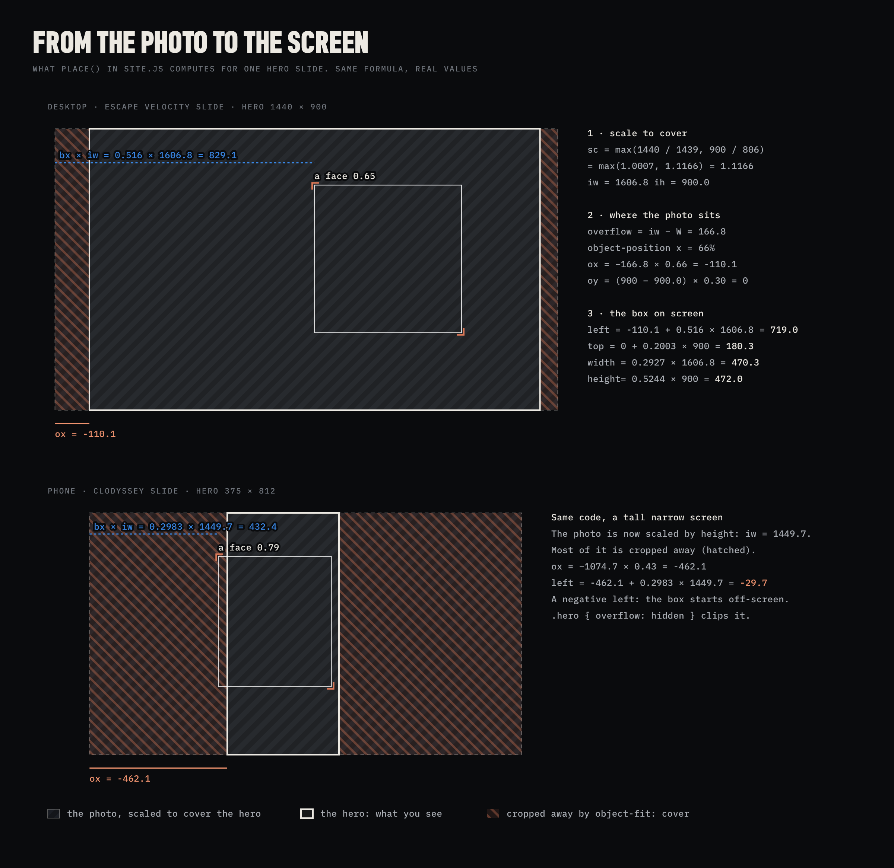

### 6.4 place(), step by step

The function ([L43–L51](static/js/site.js#L43-L51)), with its long lines split and numbered comments added:

```js
const place = () => slides.forEach(s => {
  const img = $("img", s), box = $(".cvbox", s);
  if (!box || !img.naturalWidth) return;    // no box, or the photo isn't loaded
  const [bx, by, bw, bh] = JSON.parse(s.dataset.box),  // the box, as fractions
        W = s.clientWidth, H = s.clientHeight;         // the hero's size
  const sc = Math.max(W / img.naturalWidth, H / img.naturalHeight),    // (1)
        iw = img.naturalWidth * sc, ih = img.naturalHeight * sc;       // (2)
  const [px, py] = (s.dataset.pos || "50 50").split(" ").map(Number);  // (3)
  const ox = (W - iw) * px / 100, oy = (H - ih) * py / 100;
  Object.assign(box.style, {                                           // (4)
    left: ox + bx * iw + "px", top: oy + by * ih + "px",
    width: bw * iw + "px", height: bh * ih + "px"
  });
});
```

**(1) Scale to cover.** `W / naturalWidth` is the scale at which the photo's width would exactly fill the hero, and
`H / naturalHeight` does the same for the height. Cover takes the larger of the two, so both sides end up at least as
big as the hero. (`object-fit: contain` takes the smaller, so the whole photo fits inside, with empty bands.)

**(2) The size on screen** is the natural size times the scale: `iw` by `ih`.

**(3) Where the photo sits.** With percentages, `object-position` lines up the point px% across the photo with the point
px% across the hero. In numbers, the photo's left edge lands at `(W − iw) × px / 100`. At 0% the left edges meet, at
100% the right edges meet, and at 66% the photo moves left by 66% of the part that sticks out. When the photo is wider
than the hero, `W − iw` is negative, so `ox` is negative too: the photo starts off-screen to the left.

**(4) Fractions to pixels.** A point a fraction `bx` of the way across the photo is at `ox + bx × iw` on the screen. The
width and the height only need the scale: `bw × iw` and `bh × ih`.

The same arithmetic with real values, for the ESCAPE VELOCITY slide in a 1440 × 900 window:

| Step | Arithmetic | Result |
|---|---|---|
| Hero size | `W × H` | 1440 × 900 |
| Natural size of the photo | `naturalWidth × naturalHeight` (see the note below) | 1439 × 806 |
| (1) Scale | max(1440 / 1439, 900 / 806) = max(1.0007, 1.1166) | 1.1166 |
| (2) Size on screen | 1439 × 1.1166 and 806 × 1.1166 | 1606.8 × 900 |
| (3) Offset | (1440 − 1606.8) × 0.66 and (900 − 900) × 0.30 | −110.1 and 0 |
| (4) left | −110.1 + 0.516 × 1606.8 | 719.0px |
| (4) top | 0 + 0.2003 × 900 | 180.3px |
| (4) width | 0.2927 × 1606.8 | 470.3px |
| (4) height | 0.5244 × 900 | 472.0px |

The height decided the scale (1.1166 is the larger ratio), so the photo fits the height exactly and 166.8px of its
width sticks out. `object-position: 66%` hides 110.1px of that on the left and 56.7px on the right.

> [!NOTE]
> **About `naturalWidth`.** With `srcset`, `naturalWidth` is not the pixel width of the file. The browser picks a
> file to suit the window (here the 1800px one) and reports its size divided by the file's density, which works out at
> the width of the window the file was chosen for: 1439 × 806 in this measurement. For place() only the photo's shape
> matters, and the three files have the same shape, so the result is the same whichever file loads.

The [face-box playground](https://plexormedia.github.io/claudia-gallery-study2/play/facebox.html) runs this arithmetic
for any screen you choose and shows it in a table like the one above. It loads the 1800px file without `srcset`, so its
natural size is 1800 × 1008 and a few decimals differ, but the box lands in the same place: left 719.0px, top 180.3px.

**On a phone** the same code does something more dramatic. In a 375 × 812 window the hero is tall and narrow, so the
height decides the scale, and the photo is drawn 1449.7px wide, almost four times the width of the screen. Most of it
is cropped away. For the CLODYSSEY slide (`data-pos="43 35"`):

```
ox   = (375 − 1449.7) × 0.43           = −462.1
left = −462.1 + 0.2983 × 1449.7        = −29.7
```

A negative `left`: the box starts 29.7px off-screen. Nothing has to handle that specially, because
`.hero { overflow: hidden }` clips the box just as it clips the photo.

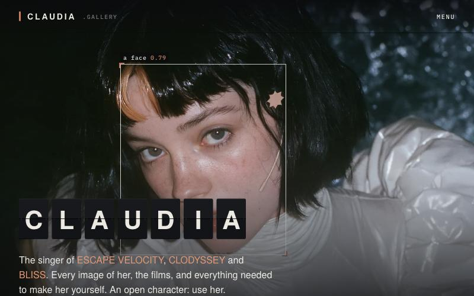

*The CLODYSSEY slide in an 800 × 500 window. The hero is 600px tall here (its `min-height`), so its bottom is out of
view. place() put the box at left 202.9px and top 107.9px, 280.3 × 323.1px, and it sits on the face.*

### 6.5 The box's CSS

```css
.cvbox {                                 /* L81 */
  position: absolute;                    /* placed by the script */
  border: 1px solid rgba(255,255,255,.82);
  pointer-events: none;                  /* taps go through */
  opacity: 0;
  transition: opacity .6s .9s;           /* a .6s fade, after .9s */
}
.slide.on .cvbox { opacity: 1; }         /* L82 */

.cvbox span {                            /* the label, L83 */
  position: absolute;
  left: -1px;                            /* align with the border's outer edge */
  bottom: 100%; margin-bottom: 4px;      /* sit 4px above the box */
  white-space: nowrap;
  font: 500 10px/1 var(--mono); letter-spacing: .06em;
  background: rgba(10,11,13,.66); color: #fff;
  padding: 3px 5px;
}
.cvbox span b { color: var(--clay2); font-weight: 500; }   /* the score, L84 */

.cvbox::before, .cvbox::after {          /* corner brackets, L85–L87 */
  content: ""; position: absolute;
  width: 9px; height: 9px;
  border: 2px solid var(--clay);
}
/* top left, then bottom right */
.cvbox::before { left: -3px; top: -3px; border-right: 0; border-bottom: 0; }
.cvbox::after { right: -3px; bottom: -3px; border-left: 0; border-top: 0; }
```

Three techniques:

- **Corner brackets from borders.** Each pseudo-element is a 9 × 9px square with only two of its four borders drawn,
  so it looks like an L. Pushed 3px out, it sits over a corner of the white frame. The same trick, bigger and in ink,
  frames the photos in section 01 (see 7.1).
- **A label on top of the box, with `bottom: 100%`.** For an absolutely positioned element, `bottom: 100%` puts its
  bottom edge at the top of the box it's positioned in, whatever the label's own height.
- **A delay in the transition.** The second time in `transition: opacity .6s .9s` is a delay. When a slide turns on,
  its photo fades in over 1.8 seconds; the box waits 0.9 seconds, then fades in over 0.6, so it appears once the photo
  is mostly there. The delay works both ways: when the slide turns off, the box also waits 0.9 seconds before it fades
  out.

### 6.6 The slideshow around it

```js
// site.js L52–L63
const show = n => {
  i = (n + slides.length) % slides.length;     // wrap around: 3 → 0, −1 → 2
  slides.forEach((s, k) => s.classList.toggle("on", k === i));
  pips.forEach((p, k) => p.classList.toggle("on", k === i));
  const d = slides[i].dataset;
  rd.forEach(el => { el.textContent = d[el.dataset.rd] || ""; });
};
const run = () => {
  clearInterval(timer);
  if (!RM) timer = setInterval(() => show(i + 1), 7000);
};
pips.forEach((p, k) => p.addEventListener("click", () => { show(k); run(); }));
slides.forEach(s => {
  const im = $("img", s);
  im.complete ? place() : im.addEventListener("load", place);
});
addEventListener("resize", place);
show(0); run();
```

- `show(n)` turns on slide n and its pip. Adding the number of slides before taking the remainder (`%`) makes the
  wrap-around work backwards too.
- **The readout is a tiny data binding.** Its elements carry `data-rd="film"` or `data-rd="id"`: the name of the slide
  attribute they display. `d[el.dataset.rd]` looks that name up in the active slide's `dataset`, so `data-rd="film"`
  shows the slide's `data-film`. To display another attribute you only change the HTML.
- `run()` advances every 7 seconds. Clicking a pip shows that slide and calls `run()` again, which restarts the
  7-second count. With reduced motion there's no automatic advance.
- **When the boxes are placed:** as soon as each photo has loaded (or straight away if it already has), and again
  whenever the window is resized.

Each photo also zooms out slowly while its slide is on ([L78–L79](static/css/site.css#L78-L79)):

```css
.hero .slide img {
  transform: scale(1.045);
  transition: transform 10s cubic-bezier(.2,.6,.3,1);
}
.hero .slide.on img { transform: scale(1); }
```

place() works out each box for the photo at its final size, `scale(1)`. While the zoom is still running, the face is a
little bigger than its box. Just after the box has faded in (1.5 seconds after the slide turns on), the ESCAPE VELOCITY
face reaches 12px past the box's right edge; after 3 seconds the gap is 6px, and after 5 seconds 2px. So the box
appears slightly loose and tightens onto the face as the photo settles. (The first slide doesn't zoom when the page
loads: it has the class `on` from the start, and transitions don't run on a page's first styles.) The face-box
playground has the zoom on a slider: at 102.6%, where the zoom is 1.5 seconds in, the box misses by 12px.

### 6.7 Reuse it: coverBox()

The same arithmetic, as a function you can use anywhere:

```js
// Where does a box, given as fractions of a photo, land on screen
// when the photo is drawn with object-fit: cover?
function coverBox([bx, by, bw, bh], natW, natH, W, H, posX = 50, posY = 50) {
  const sc = Math.max(W / natW, H / natH);   // cover: the larger scale wins
  const iw = natW * sc, ih = natH * sc;      // the photo's size on screen
  const ox = (W - iw) * posX / 100;          // where its corner lands
  const oy = (H - ih) * posY / 100;
  return { left: ox + bx * iw, top: oy + by * ih, width: bw * iw, height: bh * ih };
}

coverBox([0.516, 0.2003, 0.2927, 0.5244], 2944, 1648, 1440, 900, 66, 30);
// → { left: 718.88, top: 180.27, width: 470.59, height: 471.96 }
```

It works for any image drawn with `object-fit: cover`: hotspots on a product photo, labels pinned to points on a map, a
highlight on a screenshot. You can pass the file's real pixel size (2944 × 1648 here) or the browser's
`naturalWidth` and `naturalHeight`, because only the ratio matters. (The small difference from 719.0 comes from the
browser rounding its natural size to 1439 × 806.)

For `object-fit: contain`, change `Math.max` to `Math.min`. With the same values the photo then fits the width (1440 ×
806.1, with empty bands above and below), and the box lands at left 743.0px, top 189.6px.

### Try it: face boxes

The CSS of all three is in the [CSS lab](https://plexormedia.github.io/claudia-gallery-study2/play/lab.html), one tap
each. The JavaScript half of the first two, `Math.min` for contain and asking the image for its position, is the
"Fixed" place() in the [face-box playground](https://plexormedia.github.io/claudia-gallery-study2/play/facebox.html).

**1. Contain instead of cover.**

```css
.hero .slide img { object-fit: contain; }
```

The photos shrink to fit, with black bands, but the boxes stay where they were, because place() still does the
cover arithmetic. Now change `Math.max` to `Math.min` in [`site.js` L47](static/js/site.js#L47), and the boxes
follow the faces again.

**2. Break the copy of `object-position`.**

```css
.hero .slide img { object-position: 50% 50% !important; }
```

The photos re-centre, but the boxes keep following `data-pos`, so they miss the faces. The `!important` is needed
because the HTML sets `object-position` in a `style` attribute, and an inline style beats any stylesheet rule that
isn't `!important`. A sturdier place() would ask the image instead of keeping a copy:
`getComputedStyle(img).objectPosition` returns `"66% 30%"`.

**3. Show the box at once.**

```css
.cvbox { transition-delay: 0s; }
```

The box now appears while the photo is still fading in. Compare which version feels more like a detector finding the
face.

---

## 7. Smaller patterns worth borrowing

### 7.1 Corner brackets on anything

```css
.frame { position: relative; }                       /* L132 */
.frame::before, .frame::after {                      /* L133 */
  content: ""; position: absolute; width: 14px; height: 14px;
  border: 1px solid var(--ink); opacity: .7;
  pointer-events: none; z-index: 2;
}
/* L134–L135 */
.frame::before { left: -6px; top: -6px; border-right: 0; border-bottom: 0; }
.frame::after { right: -6px; bottom: -6px; border-left: 0; border-top: 0; }
```

Add the class `frame` to an element and it gets two viewfinder corners, 6px outside its edges, with no extra HTML and
no images. The face sheet in Who she is shows them. The ESCAPE VELOCITY video has the class too, but its corners never
appear: `.film-media` has `overflow: hidden` ([L152](static/css/site.css#L152)), which clips everything outside the
box, including corners drawn 6px outside it. This trick only works on an element that doesn't clip its own overflow.

### 7.2 One listener for every Copy button

```js
// site.js L74–L83
document.addEventListener("click", e => {
  const b = e.target.closest(".copy");
  if (!b) return;
  const src = b.dataset.copy
    ? $(b.dataset.copy)
    : b.closest(".prompt,.codeblock")?.querySelector("pre");
  const text = b.dataset.text || src?.innerText || "";
  navigator.clipboard?.writeText(text.trim()).then(() => {
    const t = b.textContent; b.classList.add("ok"); b.textContent = "Copied";
    setTimeout(() => { b.classList.remove("ok"); b.textContent = t; }, 1400);
  });
});
```

- **Event delegation.** One listener on the whole document handles every button. `e.target.closest(".copy")` finds the
  button even when you tap something inside it, and buttons added to the page later work without any extra code.
- **Three ways to say what to copy,** in order: `data-text` holds the text itself (the terminal's button uses it),
  `data-copy` points at an element with a selector, and otherwise the button copies the `<pre>` in its own prompt block.
- **Feedback.** The button turns clay and says "Copied" for 1.4 seconds, then goes back to its label.
- **`?.`** (optional chaining) stops quietly when something is missing, for example `navigator.clipboard` on a page
  that isn't served over HTTPS.

### 7.3 Videos that load and play only when seen

```html
<video data-loop muted loop playsinline preload="none"
       poster="…/poster.webp" aria-hidden="true">
  <source src="…/loop.mp4" type="video/mp4">
</video>
```

```js
// site.js L67–L71
const vIO = new IntersectionObserver(es => es.forEach(e => {
  const v = e.target;
  if (e.isIntersecting && !RM) {
    if (v.preload === "none") v.preload = "auto";
    v.play().catch(() => {});
  } else v.pause();
}), { threshold: .25 });
$$("video[data-loop]").forEach(v => vIO.observe(v));
```

- `preload="none"` with a `poster`: the page shows a still image and downloads nothing of the video until it's needed.
- When a quarter of a video is on screen, the script lets it load and starts it; when it leaves the screen, it pauses.
  A video you can't see doesn't keep playing.
- `muted` and `playsinline` are what allow an iPhone or iPad to play a video by itself, inside the page, without going
  full screen.
- `play()` returns a promise that fails if the browser refuses to play; `.catch(() => {})` ignores that quietly.
- `aria-hidden="true"`: the loops are decoration, and the link around each one has its own `aria-label`.

### 7.4 Reduced motion, in both layers

The CSS ([L510–L513](static/css/site.css#L510-L513)):

```css
@media (prefers-reduced-motion: reduce) {
  *, *::before, *::after {
    animation: none !important;
    transition: none !important;
    scroll-behavior: auto !important;
  }
  .hero .slide img, .hero .slide.on img { transform: none; }
}
```

And in the JavaScript, the `RM` flag stops the split-flaps, the slideshow's automatic advance and the video loops.
Motion is handled in both layers because each layer starts its own: CSS can't stop a script's timer, and a script
doesn't control CSS transitions.

### 7.5 A Windows XP window in CSS

The BLISS video sits in an XP window drawn entirely in CSS ([L170–L181](static/css/site.css#L170-L181)). The title bar
is one linear gradient with six colour stops that imitate XP's glossy blue. The three buttons are empty `<b>` elements,
and their symbols are pseudo-elements: a bar for minimise, a box with a thicker top for maximise, and two bars turned
45° each way for the close cross:

```css
.xpw-b b.x::before, .xpw-b b.x::after {          /* the close cross: two bars... */
  content: ""; position: absolute; left: 9px; top: 3px; width: 2px; height: 13px;
  background: #fff; transform: rotate(45deg);
}
.xpw-b b.x::after { transform: rotate(-45deg); }   /* ...one turned each way */
```

---

## 8. Glossary

| Term | Meaning | See |
|---|---|---|
| `aspect-ratio` | A preferred width-to-height ratio for a box. Ignored on inline boxes. | 4.9 |
| `auto-fill` | In `repeat()`: as many columns as fit. | 4.5 |
| Block and inline boxes | Blocks stack vertically and take the full width (`div`, `p`, `h2`); inline boxes flow inside a line of text (`span`, `a`, `b`). | 4.9 |
| `clamp()` | A value with a minimum, a preferred value and a maximum. | 3.5 |
| Contrast ratio | How far apart two colours are in brightness, from 1 : 1 to 21 : 1. | 2.4 |
| CORS | The rules for when a page may use files from another website. Fonts need the other site's permission; images and video don't. | 3.3 |
| Custom property | A CSS variable, such as `--ink`. | 2.1 |
| `fr` | A share of the space left over in a grid. | 4.3 |
| `IntersectionObserver` | A browser feature that tells a script when an element enters or leaves the screen. | 5.3, 7.3 |
| `naturalWidth`, `naturalHeight` | An image's own size, as the browser reports it. | 6.4 |
| `object-fit`, `object-position` | How an image fills its box, and which part of it shows. | 6.3 |
| Pseudo-element | `::before` and `::after`: extra boxes that CSS draws inside an element without any HTML. | 5.2, 6.5 |
| Reflow | The browser working out the layout again. | 5.3 |
| `requestAnimationFrame` | Runs a function just before the next screen redraw. Paused in background tabs. | 5.3 |
| Scroll snapping | Resting points for a scrolling box, so it settles on an item. | 4.4 |
| Specificity | How the browser chooses between rules for the same element: the more specific selector wins, and between equals, the later rule. | 5.2 |
| `srcset`, `sizes` | Several files of the same image, so the browser can pick the best one for the screen. | 6.4 |
| Strut | The invisible minimum height of every line in a block, set by the block's own font and line height. | 4.9 |
| `vw`, `vh`, `svh` | 1% of the window's width, of its height, and of its height with a phone's browser bars showing. | 3.5, 4.6 |
| Token | A named value that the whole design uses, such as the colours in section 2.1. | 2.1 |
| WCAG | The Web Content Accessibility Guidelines. | 2.4 |

---

Claudia by anabology. Original site: [claudia.gallery](https://claudia.gallery/). Terms for using Claudia:
[claudia.gallery/use](https://claudia.gallery/use/).
